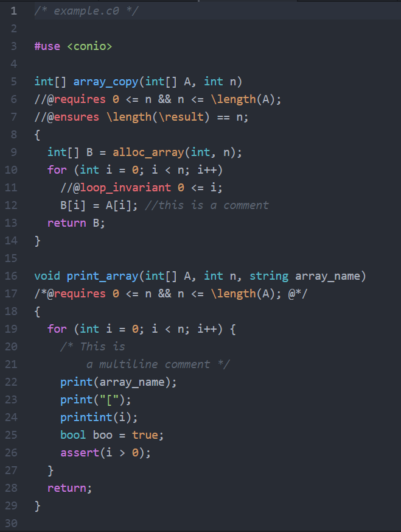

# C0-lang package

This is an Atom package that provides syntax highlighting for C0 programming language (See below for what C0 is).   
  

## What is C0

C0 is a small safe subset of the C programming language, augmented with contracts, specifically developed for teaching the course [15-122 Principles of Imperative Computation](http://www.cs.cmu.edu/~15122/) at [Carnegie Mellon University](https://www.cmu.edu).  
Here's some useful links of C0:   

- [Introduction site](http://c0.typesafety.net/)
- [Tutorial](http://c0.typesafety.net/tutorial/)
- [References](http://c0.typesafety.net/references.html)  
- [Sample codes](https://github.com/EULIR/C0-lang/tree/master/samples)

## Installation

There are two ways to install this syntax package, both of which require Atom editor has already been downloaded (in case you haven't, download Atom [here](https://atom.io/)).

- **Install in atom**

  Open Atom.   

  Click `Flie` -> `Setting` -> `Install`.   

  Search `C0-lang` in search column.   

  Click `Install` on the package.   

  Restart your Atom.   

  Congratulations! Your atom is ready to use this package and it would auto-detect any file that ends with `.c0`.  

- **Manual install**

  Find your `.atom` directory on your computer (which is always in `C://Users/xxx/`).   

  Enter `packages` directory.   

  Clone this repo here (enter the following command in cmd).  

  ```
  git clone https://github.com/EULIR/C0-lang.git
  ```

  Restart your Atom.

  Congratulations! Your atom is ready to use this package and it would auto-detect any file that ends with `.c0`.  

## Screenshot

Below is specifically how this package highlights C0 language  

  

## Why Atom

Officially, C0 language only have syntax highlight on Emacs. To extend the use of C0 language and to satisfy more non-Emacs users, this syntax highlighting package for Atom is found necessary.   

Atom has bulit-in git support (in fact, it is believed to be the son of GitHub lol) which I believe is useful and helpful. Besides, Atom has beautiful UI (lol).   

## Contributing
Contributions in any forms would be appreciated. Open an Issue on [Issue page](https://github.com/EULIR/C0-lang/issues) or start a [Pull Request](https://github.com/EULIR/C0-lang/pulls) to help build this package better and more powerful.
